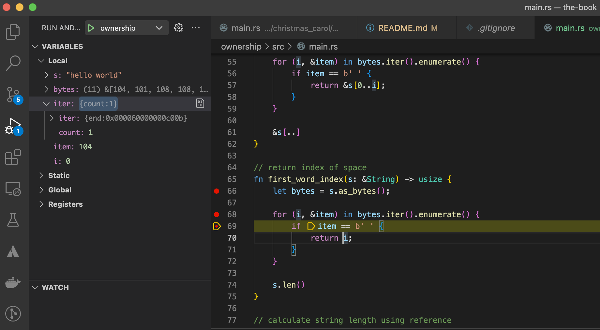

# The Book

Following along [The Book](https://doc.rust-lang.org/book/title-page.html) to document my thoughts and progress while learning Rust. I am coming from a javascript, typescript background, The sample applications we build along the way are located in the `./apps` directory:

- guessing game
- tempurature converter
- fibonacci sequencer
- christmas carol lyrics

## Ownership

Rust manages memory efficiently through `ownership`. To types of memory are stack & heap. Stacks are FIFO system such as a stack of plates. length and type must be static. This is why I cannot push data onto an array like we do so often in typescript. Tuples utilize heap based memory which require a pointer to access.

### Debug ownership

Byte logic to determine the index of new words look different than what I've seen in typescript. Let's debug it.

Using VSCode, install `Rust` & `CodeLLDB` extensions then create a `launch.json`. Put a breakpoint anywhere and F5 it.  
```
{
    "version": "0.2.0",
    "configurations": [
        {
            "name": "ownership",
            "type": "lldb",
            "request": "launch",
            "program": "${workspaceRoot}/ownership/target/debug/ownership",
            "args": [],
            "cwd": "${workspaceRoot}",
        }
    ]
}
```



## Structures

